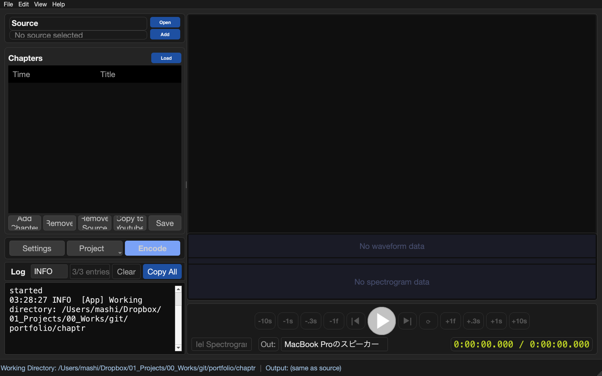
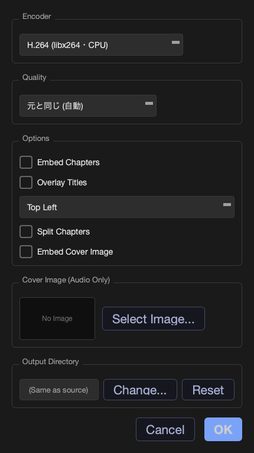
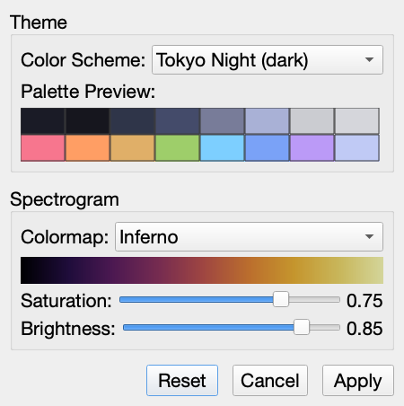

<div align="center">

# Chaptr

**波形を見ながら、動画にチャプターを。**

長尺のメディア（演奏会・レッスン・講義など）を、2段の波形とメルスペクトログラムを頼りに
素早く区切り、チャプター付き動画として書き出すデスクトップアプリ。
PySide6 + ffmpeg ベース、GPU ハードウェアエンコード対応。

[](https://opensource.org/licenses/MIT)
[](https://github.com/mashi727/chaptr/releases/latest)




</div>

## なぜ Chaptr か

長い録画から「どこで曲が変わるか」「どこが休憩か」を目で探すのは骨が折れます。
Chaptr は**音の変化を波形とスペクトログラムで可視化**し、聴き通さなくても当たりを付けてから
追い込めるようにしました。区切ったら、除外区間のカット・チャプターメタデータの埋め込み・
GPU エンコードまで、**書き出しまで一気通貫**です。

## ✨ 特長

| | 機能 | 内容 |
|---|---|---|
| 🤖 | **区間の自動判別** | 演奏・コメント・休憩の切れ目を音から推定して候補を出す。候補へスキップ → 送り戻しで微調整 → 確定でチャプター化 |
| 🎚 | **2段波形＋メルスペクトログラム** | 上段＝全体、下段＝ホバー追従の拡大（区間幅 5秒〜10分）。曲の切れ目を"見て"探せる |
| ✂️ | **除外チャプター** | チャプター名を `--` で始めると、その区間を書き出し時にカット（波形上に赤いハッチング表示） |
| ⚡ | **GPU ハードウェアエンコード** | VideoToolbox / NVENC / QSV / AMF に対応 |
| 📋 | **YouTube チャプター連携** | 現在のチャプターを YouTube 形式でコピー／貼り付けで一括取り込み |
| 🔥 | **チャプター名の映像焼き込み** | ffmpeg `drawtext`、7 位置プリセット |
| 🎬 | **音声＋カバー画像から動画生成** | カバー画像の選択・クロップにも対応 |
| 💬 | **SRT 字幕の表示** | 同名 SRT の自動ロード／任意 SRT の読み込み |
| 🖱 | **ドラッグ＆ドロップ** | 動画・音声ファイル／フォルダをそのまま追加 |
| 🎨 | **テーマ＆配色** | base16 系のカラースキームと、スペクトログラムのカラーマップ切替 |

書き出し時にはチャプターメタデータが自動で埋め込まれ、プレイヤーの目次として機能します。

## 📸 画面ツアー

### メイン画面

左に**ソース**と**チャプター表**、右に**プレビュー＋2段波形**とトランスポート。下部に処理ログ。
一画面で「見る → 区切る → 書き出す」が完結します。

<div align="center">

</div>

<!--
チャプター編集（波形）ビューの実素材スクリーンショットを撮影したら、下を有効化してください:
<div align="center">

</div>
-->

### 書き出し設定 ／ 環境設定

<table>
<tr>
<td width="50%" valign="top"></td>
<td width="50%" valign="top"></td>
</tr>
<tr>
<td align="center"><b>書き出し設定</b><br>エンコーダ（GPU/CPU）・品質・チャプター埋め込み・タイトル焼き込み位置・分割・カバー画像</td>
<td align="center"><b>環境設定</b><br>テーマ配色のプレビューと、スペクトログラムのカラーマップ・彩度・明度</td>
</tr>
</table>

## こんな用途に

- 演奏会・発表会の記録を、曲ごとにチャプター分け（休憩は `--` でカット）
- レッスン・講義の録画に目次を付けて配布
- 音声録音＋ジャケット画像から、YouTube 用の1本の動画を作成

## Installation

### pip

```bash
pip install chaptr
```

インストール後:

```bash
chaptr               # GUI を起動
chaptr ./work        # 作業ディレクトリを指定して起動
```

### ソースから

```bash
git clone https://github.com/mashi727/chaptr.git
cd chaptr
pip install -e .
chaptr
```

### バイナリ（スタンドアロン）

macOS / Windows のスタンドアロンバイナリは [Releases](https://github.com/mashi727/chaptr/releases/latest) で配布しています（タグ push 時に GitHub Actions が自動ビルド）。ffmpeg / ffprobe を内包し、**Windows は単一 `Chaptr.exe`**（インストール不要・ダブルクリックで起動）。

| プラットフォーム | パッケージ形式 | エンコード |
|---|---|---|
| macOS (Apple Silicon) | `.dmg` | VideoToolbox |
| macOS (Intel) | `.dmg` | VideoToolbox |
| Windows | 単一 `.exe` | NVENC / QSV / AMF |

## Usage

### 起動

```bash
chaptr                            # 現在のディレクトリで起動
chaptr ~/recordings/2026-05-17/   # 作業ディレクトリ指定
```

フォルダをアプリにドロップした場合、そのフォルダを作業ディレクトリとして起動します。

### 基本操作

1. **ソース追加**: 動画ファイル / 音声ファイルをドラッグ&ドロップ（または「Open / Add」）
2. **チャプター編集**: 波形上でクリックして位置設定、テーブルから追加/削除/編集
3. **書き出し**: 出力先・品質・エンコーダ・オーバーレイ位置を設定し「Encode」で実行（チャプターメタデータ自動埋め込み）

### 区間の自動判別（Detect）

長尺のリハーサル録画で「どこが演奏で、どこが指揮者のコメントで、どこが休憩か」を音から推定します。

1. **Detect**: 音声から **演奏 / コメント / 休憩** の切れ目を検出し、波形上に破線＋三角の**候補**として表示（種別ごとに色が違います）
2. **◀候補 / 候補▶**: 候補へスキップ。再生して切れ目が合っているか確かめる
3. **送り戻しで微調整**: `-1f` 〜 `+10s` のボタンで位置を詰める
4. **確定**: **いまの再生位置**を、最寄り候補の種別名でチャプターにする（確定後は自動で次の候補へ）

検出結果をチャプター表へ一括で流し込まないのは、境界の 1 秒を決めるのが人の仕事だからです。
候補はあくまで当たりで、確定した位置が答えになります。確定済みの候補は薄く残るので、
どこまで拾ったかが波形上で分かります。

休憩は `--休憩` として確定されるため、そのまま[除外チャプター](#除外チャプター)として書き出し時にカットされます。

- 同名 SRT を読み込んでいると（単一ソース時）、発話の裏付けと「休憩します」の合図を検出に併用します
- 判別は音声キャッシュの構築完了後に押せます。1 時間 45 分の素材で約 4 秒
- 素材を入れ替えると候補は破棄されます（時刻の基準が変わるため）

### 除外チャプター

チャプター名を `--` で始めると、書き出し時にその区間がカットされます。波形上に赤いハッチングで表示されます。

```
00:00:00  ブラームス第1番 第1楽章
00:12:34  --休憩
00:18:00  ブラームス第1番 第2楽章
```

### YouTube チャプター連携

- 📋 ボタン: 現在のチャプターを YouTube 形式でクリップボードへコピー
- Cmd+V / Ctrl+V: YouTube チャプター形式のテキストをペーストしてチャプターを一括取り込み

### キーボードショートカット

| ショートカット | 動作 |
|---|---|
| Space | 再生 / 一時停止 |
| ←  → | 5 秒前 / 5 秒後 |
| ↑  ↓ | 前 / 次のチャプターへジャンプ |
| Cmd+S | プロジェクト保存 |
| Cmd+Shift+L | SRT 字幕読み込み |

### Tips

- **重い原盤は軽いプロキシで開く**: 高ビットレートの HEVC 1080p などはプレビューがもたつく。
  480p 程度のプロキシを作って開くと快適:

  ```bash
  ffmpeg -i in.mp4 -vf scale=-2:480 -c:v hevc_videotoolbox -b:v 1.2M -tag:v hvc1 \
    -c:a copy -movflags +faststart out_480p.mp4
  ```

- **バックグラウンド起動**（`code` のように端末から切り離す）は zsh 関数で:

  ```zsh
  chaptr() { command chaptr "$@" </dev/null &>/dev/null &! }
  ```

  波形生成の ffmpeg が端末 stdin を握って止まらないよう `-nostdin` 済み。`</dev/null` 併用が安全。

## Development

```bash
git clone https://github.com/mashi727/chaptr.git
cd chaptr
pip install -e ".[dev]"
pytest                       # テスト実行
python run_chaptr.py         # 開発モードで起動
```

### ビルド（バイナリ生成）

```bash
pip install pyinstaller
pyinstaller chaptr.spec      # dist/ にバイナリ生成
```

## 関連プロジェクト

Chaptr は単機能のチャプター編集に特化していますが、より大きな「メディア → 字幕 → レポート PDF」
ワークフローの一部として設計されています。関連リポジトリ:

- [media-scribe-workflow](https://github.com/mashi727/media-scribe-workflow) — Chaptr の派生元。CLI ツール群と LaTeX レポート生成パイプラインを含む

## License

MIT — see [LICENSE](LICENSE).

## Contributing

Issue / PR 歓迎します。バグ報告時は OS / Python / PySide6 のバージョンを記載してください。
