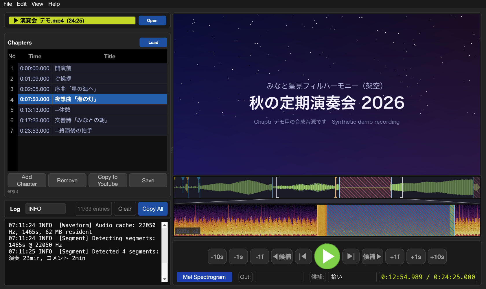
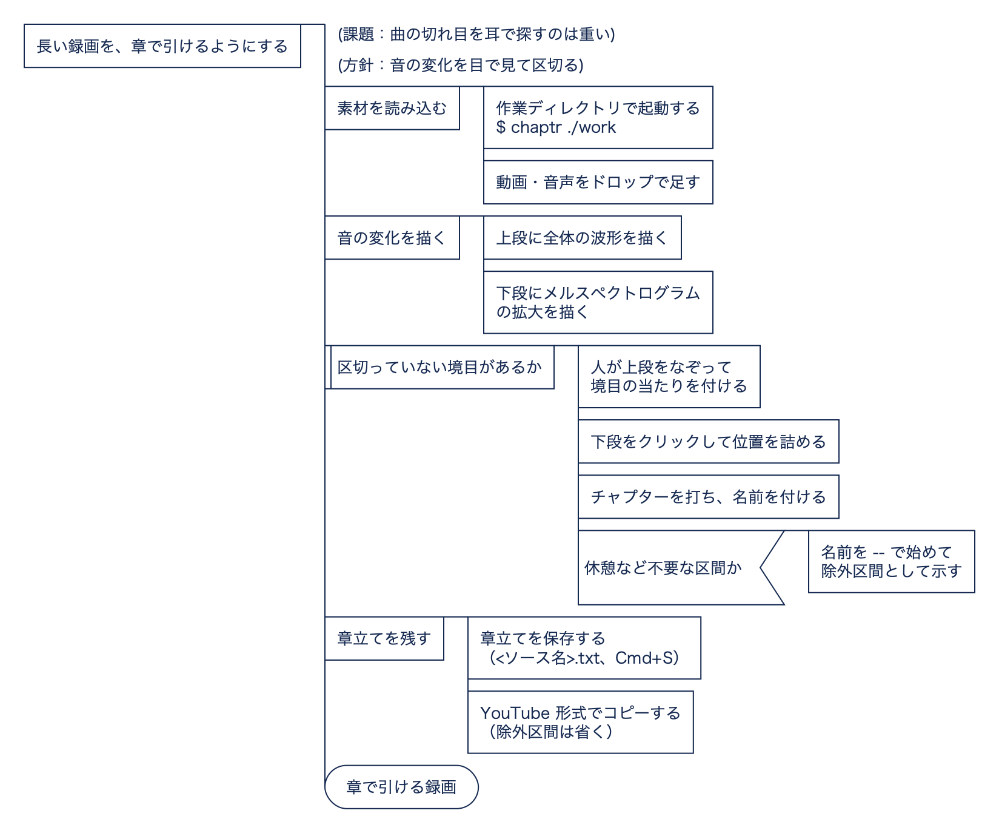
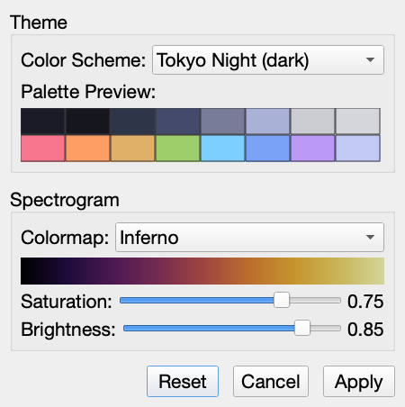

<div align="center">

# Chaptr

**波形を見ながら、動画にチャプターを。**

長尺のメディア（演奏会・レッスン・講義など）を、2段の波形とメルスペクトログラムを頼りに
素早く区切るデスクトップアプリ。章立てはテキスト（`<ソース名>.txt`）に保存し、書き出しは
[media-scribe-workflow](https://github.com/mashi727/media-scribe-workflow) の CLI に任せます。PySide6 + ffmpeg ベース。

[](https://opensource.org/licenses/MIT)
[](https://github.com/mashi727/chaptr/releases/latest)




<sub>約 25 分の演奏会録画を区切っているところ。休憩と終演後の拍手は <code>--</code> で除外（赤い斜線）。<br>素材は撮影用に合成した架空の演奏会です。</sub>

</div>

## 考え方

何が課題で、それをどう解いているかを PAD（問題分析図）で示します。各段の詳細は下の各節を参照してください。



<sub>図の元は [`docs/pad/concept.spd`](docs/pad/concept.spd)。[padkit](https://github.com/mashi727/padkit) で検査・描画しています。</sub>

## なぜ Chaptr か

長い録画から「どこで曲が変わるか」「どこが休憩か」を目で探すのは骨が折れます。
Chaptr は**音の変化を波形とスペクトログラムで可視化**し、聴き通さなくても当たりを付けてから
追い込めるようにしました。

Chaptr が受け持つのは、**人が判断しなければならない境界を決めるところまで**です。
以前は書き出し（エンコード）も GUI に持っていましたが、判断と関係のない処理なので外し、
CLI（`vce-encode` / `vce-split`）に戻しました。GUI は小さく保ち、書き出しは何度でも同じ結果で
やり直せるようにしています。

## ✨ 特長

| | 機能 | 内容 |
|---|---|---|
| 🎚 | **2段波形＋メルスペクトログラム** | 上段＝全体、下段＝ホバー追従の拡大（区間幅 5秒〜10分）。曲の切れ目を"見て"探せる |
| ✂️ | **除外チャプター** | チャプター名を `--` で始めると除外区間の印になる（波形上に赤いハッチング表示）。書き出し時に `vce-encode` がカット |
| 💾 | **章立ての保存** | `<ソース名>.txt`（`# source:` 付きの章立てテキスト）に保存／読み込み。media-scribe-workflow の `vce-encode` / `vce-split` がそのまま読む |
| 📋 | **YouTube チャプター連携** | 現在のチャプターを YouTube 形式でコピー／貼り付けで一括取り込み |
| 💬 | **SRT 字幕の表示** | 同名 SRT の自動ロード／任意 SRT の読み込み |
| 🖱 | **ドラッグ＆ドロップ** | 動画・音声ファイル／フォルダをそのまま追加 |
| 🎨 | **テーマ＆配色** | base16 系のカラースキームと、スペクトログラムのカラーマップ切替 |

## 📸 画面ツアー

### メイン画面

左に**ソース**と**チャプター表**、右に**プレビュー＋2段波形**とトランスポート。下部に処理ログ。
一画面で「見る → 区切る → 保存する」が完結します。

<div align="center">

</div>

- **上段**は全体の波形。白い括弧が下段に拡大している範囲で、`--` で始まる除外チャプター（休憩・終演後の拍手）は赤い斜線で示されます。
- **下段**はその範囲のメルスペクトログラム。曲の終わり → 拍手 → 休憩の静けさ、と音の性格の変わり目が色で見分けられます。

### 環境設定

<div align="center">

</div>

テーマ配色のプレビューと、スペクトログラムのカラーマップ・彩度・明度。

## こんな用途に

- 演奏会・発表会の記録を、曲ごとにチャプター分け（休憩は `--` で除外の印）
- レッスン・講義の録画に目次を付け、YouTube の概要欄へ貼る
- 章立てを media-scribe-workflow へ渡し、チャプター付き動画や章ごとの分割動画を作る

## Installation

### pip

```bash
pip install chaptr
```

インストール後:

```bash
chaptr               # GUI を起動
chaptr ./work        # 作業ディレクトリを指定して起動
```

### ソースから

```bash
git clone https://github.com/mashi727/chaptr.git
cd chaptr
pip install -e .
chaptr
```

### バイナリ（スタンドアロン）

macOS / Windows のスタンドアロンバイナリは [Releases](https://github.com/mashi727/chaptr/releases/latest) で配布しています（タグ push 時に GitHub Actions が自動ビルド）。ffmpeg / ffprobe を内包し、**Windows は単一 `Chaptr.exe`**（インストール不要・ダブルクリックで起動）。

| プラットフォーム | パッケージ形式 |
|---|---|
| macOS (Apple Silicon) | `.dmg` |
| macOS (Intel) | `.dmg` |
| Windows | 単一 `.exe` |

## Usage

### 起動

```bash
chaptr                            # 現在のディレクトリで起動
chaptr ~/recordings/2026-05-17/   # 作業ディレクトリ指定
```

フォルダをアプリにドロップした場合、そのフォルダを作業ディレクトリとして起動します。

### 基本操作

1. **ソース追加**: 動画ファイル / 音声ファイルをドラッグ&ドロップ（または File → Open Folder）
2. **チャプター編集**: 波形上でクリックして位置設定、テーブルから追加/削除/編集
3. **保存**: File → Save Chapters で `<ソース名>.txt` に保存
4. **書き出し**（Chaptr の外）: media-scribe-workflow の CLI で動画にする

   ```bash
   vce-encode video.txt     # チャプター付き単一動画（除外区間はカット）
   vce-split  video.txt     # チャプターごとの分割動画
   ```

### 除外チャプター

チャプター名を `--` で始めると、その区間は除外区間になります。波形上に赤いハッチングで表示され、`vce-encode` で書き出すときにカットされます。

```
00:00:00  ブラームス第1番 第1楽章
00:12:34  --休憩
00:18:00  ブラームス第1番 第2楽章
```

### YouTube チャプター連携

- 📋 ボタン: 現在のチャプターを YouTube 形式でクリップボードへコピー
- Cmd+V / Ctrl+V: YouTube チャプター形式のテキストをペーストしてチャプターを一括取り込み

### キーボードショートカット

| ショートカット | 動作 |
|---|---|
| Space | 再生 / 一時停止 |
| ←  → | 5 秒前 / 5 秒後 |
| ↑  ↓ | 前 / 次のチャプターへジャンプ |
| Cmd+O | フォルダを開く |
| Cmd+L / Cmd+S | 章立ての読み込み / 保存（`.txt`） |
| Cmd+V | YouTube 形式のチャプターを貼り付け |
| Cmd+Shift+L | SRT 字幕読み込み |

### Tips

- **重い原盤は軽いプロキシで開く**: 高ビットレートの HEVC 1080p などはプレビューがもたつく。
  480p 程度のプロキシを作って開くと快適:

  ```bash
  ffmpeg -i in.mp4 -vf scale=-2:480 -c:v hevc_videotoolbox -b:v 1.2M -tag:v hvc1 \
    -c:a copy -movflags +faststart out_480p.mp4
  ```

- **バックグラウンド起動**（`code` のように端末から切り離す）は zsh 関数で:

  ```zsh
  chaptr() { command chaptr "$@" </dev/null &>/dev/null &! }
  ```

  波形生成の ffmpeg が端末 stdin を握って止まらないよう `-nostdin` 済み。`</dev/null` 併用が安全。

## Development

```bash
git clone https://github.com/mashi727/chaptr.git
cd chaptr
pip install -e ".[dev]"
pytest                       # テスト実行
python run_chaptr.py         # 開発モードで起動
```

### ビルド（バイナリ生成）

```bash
pip install pyinstaller
pyinstaller chaptr.spec      # dist/ にバイナリ生成
```

## 関連プロジェクト

Chaptr は単機能のチャプター編集に特化していますが、より大きな「メディア → 字幕 → レポート PDF」
ワークフローの一部として設計されています。関連リポジトリ:

- [media-scribe-workflow](https://github.com/mashi727/media-scribe-workflow) — Chaptr の派生元。章立ての `.txt` を読んで書き出す `vce-encode` / `vce-split` と、LaTeX レポート生成パイプラインを含む

## License

MIT — see [LICENSE](LICENSE).

## Contributing

Issue / PR 歓迎します。バグ報告時は OS / Python / PySide6 のバージョンを記載してください。
